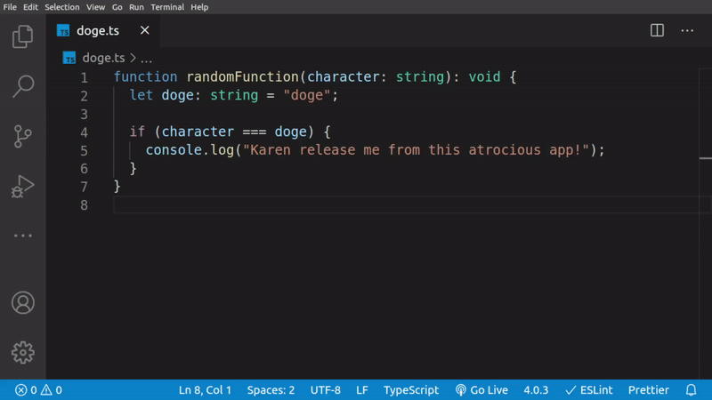
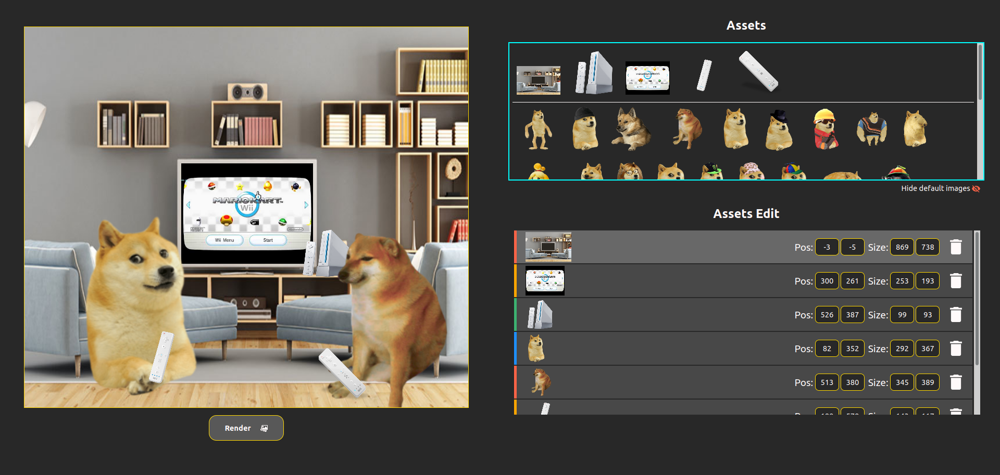
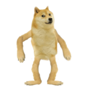
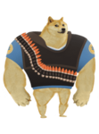
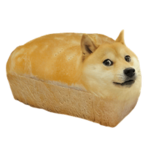

# Doge for Visual Studio Code <!-- omit in toc -->

This extension adds Dogelore characters into Visual Studio Code and a feature to
create memes.

It was initially inspired by the **[doge](https://atom.io/packages/doge)** Atom
package developped by **tyler0706**!

---

## Summary <!-- omit in toc -->

- [Features](#features)
  - [Show Dogelore characters on hover](#show-dogelore-characters-on-hover)
  - [Create memes inside your browser](#create-memes-inside-your-browser)
- [Characters](#characters)
- [Installation](#installation)
- [Known Issues](#known-issues)
- [Release Notes](#release-notes)
  - [[1.1.0] - Local images](#110---local-images)
- [Upcoming release](#upcoming-release)

---

## Features

### Show Dogelore characters on hover

When hovering above the name of the characters in your code, a popup will appear
with the character's image.

### Create memes inside your browser

This extension lets you create memes, or in general images, inside your default
browser. It is a very basic and simple version of a photo editing software. This
feature also works offline.

To execute this feature / command, you can either :

- Press `Ctrl+E, Ctrl+D` or `Cmd+E, Cmd+D` on Mac.
- Open the command terminal with `Ctrl+Shift+P` or `Cmd+Shift+P` on Mac)
  and type the command `Doge`.

This will create a `.dogeapp` folder and a `Doge.md` file inside your current
workspace / folder. The folder contains all of the code that allows you to use
the app to create memes, while the file displays how to use the app.

The extension already has several defaults images already available for use, but
you can add your personal images inside of a `img` folder. The app will take the
images inside that folder each time you execute the feature / command.

**Comment** : the next tool to be implemented in the app will allow adding text
into the memes.

**Warning** : in order to launch the app you need to install the
`ritwickdey.liveserver` Visual Studio Code extension (available on the
marketplace, or
[here](https://marketplace.visualstudio.com/items?itemName=ritwickdey.LiveServer)).

---

## Characters

| Character   |                          Image                          |
| :---------- | :-----------------------------------------------------: |
| Abomination |  |
| BigBro      |                 |
| Caeser      |                 |
| Cheems      |                 |
| Doge        |                       |
| Dogelas     |              |
| Engineer    |           |
| Heavy       |                    |
| Henry       |                    |
| Isabelle    |           |
| Jim         |                          |
| Karen       |                    |
| KidDoge     |              |
| Kyle        |                       |
| Kylie       |                    |
| LilBro      |                 |
| Loafe       |                    |
| Milton      |                 |
| Monke       |                    |
| Murphy      |                 |
| Perro       |                    |
| Petyr       |                    |
| Phishe      |                 |
| Phoebe      |                 |
| Rupert      |                 |
| Soldier     |              |
| Spym        |                       |
| Stuff       |                    |
| Swagcat     |              |
| Walter      |                 |

---

## Installation

[How to install Visual Studio Code
extensions](https://code.visualstudio.com/docs/editor/extension-gallery)

---

## Known Issues

No known issues until now.

---

## Release Notes

### [1.1.0] - Local images

- Images are now locally displayed
- Allows for them to be viewed offline

---

## Upcoming release

Next release will allow adding text into memes.
