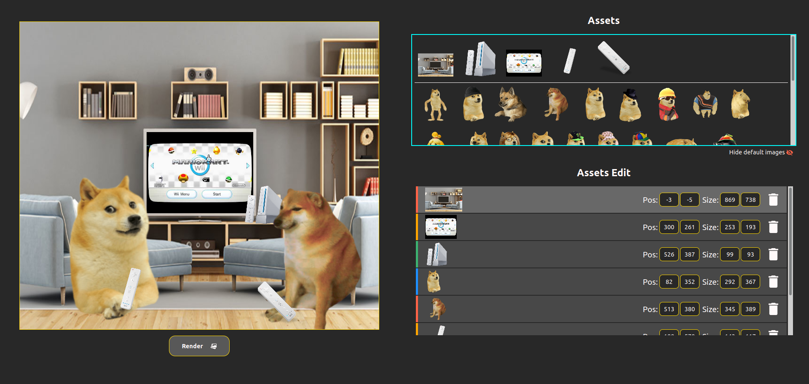

# Doge Instructions <!-- omit in toc -->

Hello! Here are the instructions to understand how to use the Doge Extension.

You've already managed to launch the app! That's great!

## Summary <!-- omit in toc -->

- [Get Started](#get-started)
- [Canvas](#canvas)
- [Assets Container](#assets-container)
- [Add custom images](#add-custom-images)
- [Notes](#notes)

## Get Started

This features lets you quickly create memes inside your browser, thanks to
Visual Studio Code.

The User Interface looks like this :

## Canvas

On the left-hand side of the screen you will find the canvas, on which you place
your images. You can drag these images around inside of the canvas, and position
them however you like.

Under the canvas, you can find the button that allows to render and download
your meme / image.

## Assets Container

On the right-hand side you will find your assets at the top : these assets are
all of the images available on the app. Inside of this container appear [custom
images](#add-custom-images), but also some default images, consisting of the
dogelore characters. You can hide / show the default images by pressing on the
button underneath the cyan box.

Simply click on an image in order to add it to the canvas.

At the bottom you will find all of the information about the images you have
added on the canvas. You can change the position and size of each image, and you
can also remove it from the canvas as well.

These images appear in a particular order : at the top will be the image
furthest in the back, and the bottom, the image closest closest to the front.
You can drag these boxes around the list to change their position according to
the other images.

## Add custom images

In order to add custom images into the app, you need to create an `img` folder
in Visual Studio Code, at the root of your workspace / folder.

You can add all of your images inside that folder.

Supported image formats are :

- apng
- bmp
- gif
- ico
- cur
- jpg
- jpeg
- jfif
- pjpeg
- pjp
- png
- svg
- tif
- tiff
- webp

In order for the app to take into account these images, you need to add all of
the images you need before you launch it. Otherwise, you can launch it once
again, but a new window will be created, therefore the previous will become
useless.

## Notes

In order to launch the app you need to install the `ritwickdey.liveserver` Visual
Studio Code extension (available on the marketplace, or
[here](https://marketplace.visualstudio.com/items?itemName=ritwickdey.LiveServer)).

Some tools like cropping the canvas or mouse and keyboard inputs have not yet been developped, they will come available with the upcoming releases.

The following tools will be developped for the upcoming releases :

- Add text as an asset
- Better asset editing with image rotation and flip
- More Mouse and Keyboard shortcuts
